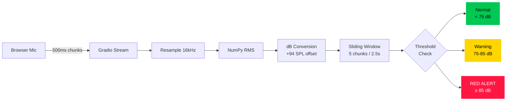
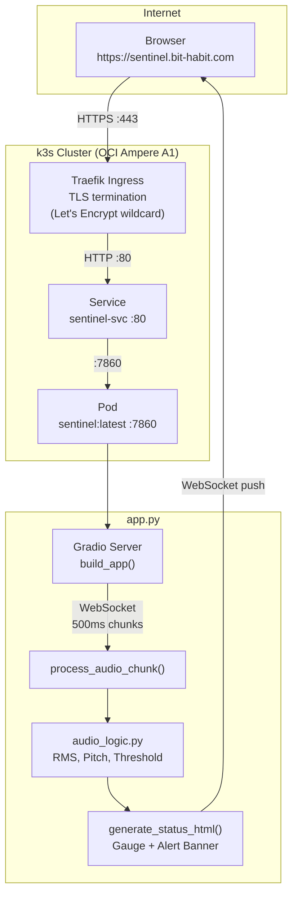
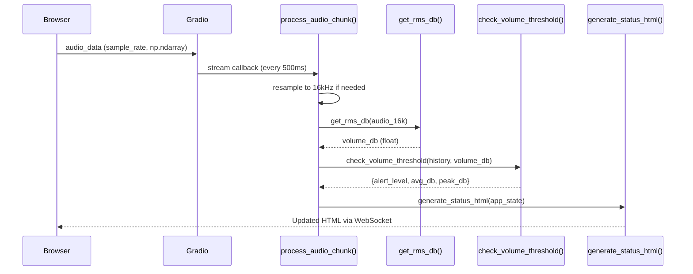

# Sentinel: Real-time Cognitive Assistant

[](https://sentinel.bit-habit.com)
[](https://sentinel.bit-habit.com)
[](https://python.org)
[](https://sentinel.bit-habit.com)

A real-time voice monitor that detects raised voices and alerts people before conversations get out of hand. Built with **local-first computation** — no cloud API needed for core detection.

**Live at https://sentinel.bit-habit.com**

> **1st Place — Megazone Cloud AI Agent Hackathon**  
> Weekly mentoring with Infobank CTO to validate tech decisions from a business perspective

---

## Why This Exists

When couples or coworkers argue, they often don't realize they're raising their voices. And it's awkward for others to point it out.

No existing communication tool provides **real-time feedback on vocal tone**. Sentinel fills that gap — an AI that monitors conversations like a neutral third party and warns when things get heated.

---

## Design Philosophy: Cost First

We chose **local NumPy math** instead of expensive cloud APIs for core detection. LLM APIs will only be added in later versions where AI is actually needed (emotion analysis, etc.).

| Factor | Cloud Speech API | Local NumPy (chosen) |
|---|---|---|
| **Cost** | ~$0.06/min | **$0.00** |
| **Latency** | ~200ms (network) | **< 10ms** |
| **Privacy** | Audio sent to third party | **Stays on device** |
| **Availability** | Needs internet + API uptime | **Always works** |

Volume detection doesn't need AI — it's pure signal math.

---

## Current State: v0.1 (Volume + Pitch Guard)

### Features

- **Real-time volume (dB) gauge** — green / yellow / red
- **10-second persistent alert** — warning stays visible long enough for people to notice
- **Pitch detection (FFT)** — tracks vocal frequency in 85–400Hz range
- **Adaptive sensitivity slider** (0.5–2.0) — quiet meeting room vs noisy cafe
- **Mobile vibration** — device buzzes on alert
- **Zero cloud API calls** — everything runs locally

### Audio Pipeline



### Why a Sliding Window?

| Decision | Value | Why |
|---|---|---|
| Window size | 5 chunks (2.5s) | A cough is < 500ms — affects only 1 of 5 readings. Real shouting lasts 1–2 seconds and pushes the average over the threshold |
| `-inf` filtering | Silence excluded | Quiet moments don't mask loud ones |
| Alert persistence | 10 seconds | Gives people time to notice and lower their voice |
| Red > Yellow | No downgrade mid-alert | Red stays red even if a yellow-level sound follows |

### dB Reference

| dB SPL | What it sounds like |
|---|---|
| 30 | Whisper, quiet library |
| 60 | Normal conversation |
| 75 | Loud talking (**Warning threshold**) |
| 85 | Shouting, heavy traffic (**Red Alert**, OSHA limit) |
| 100 | Rock concert |

---

## Architecture

### Request Lifecycle



### Real-time Streaming



---

## Roadmap

Each version adds a new layer of intelligence.

| Version | Milestone | Status |
|---------|-----------|--------|
| **v0.0** | Volume gauge + 10s persistent alert | **Deployed** |
| **v0.1** | Pitch detection + adaptive sensitivity + mobile vibration | **Deployed** |
| v0.2 | VAD-gated emotion detection (Silero + OpenAI Realtime API) | Planned |
| v0.3 | Speaker diarization + color-coded transcript | Planned |
| v0.4 | Claim detection + fact-checking (Tavily) | Planned |
| v0.5 | Edge AI migration (local vLLM, $0 token cost) | Planned |
| v1.0 | Slack/Zoom alerts + autonomous verbal mediation | Planned |

---

## Tech Stack

| Layer | Technology | Why |
|-------|-----------|-----|
| Frontend | Gradio 4.0+ | Python-native streaming, fast prototyping |
| Audio Math | NumPy | RMS/dB/FFT, zero dependencies, < 10ms |
| Container | Docker + Python 3.10 slim | Lightweight, reproducible |
| Orchestration | K3s on Oracle OCI | Free tier, production Kubernetes |
| Ingress | Traefik + cert-manager | Auto TLS via Let's Encrypt wildcard |
| GitOps | ArgoCD | Declarative deployment, auto-sync |

---

## Project Structure

```
sentinel-real-time-cognitive-assistant/
├── app.py               # Gradio app — streaming + gauge + alert
├── audio_logic.py       # RMS, dB, pitch (FFT), threshold logic
├── vad.py               # Voice Activity Detection (future)
├── audio_buffer.py      # Circular buffer for speech chunks (future)
├── requirements.txt     # gradio, numpy
├── Dockerfile
├── CLAUDE.md            # Claude Code project instructions
├── k8s/
│   ├── deployment.yaml
│   ├── service.yaml
│   ├── ingress.yaml
│   └── secret.yaml.example
└── docs/
    ├── guide-v0.0-volume-gauge.md
    ├── guide-v0.1-pitch-guard.md
    └── guide-request-lifecycle.md
```

---

## Quick Start

```bash
# Run locally
git clone git@github.com:bookseal/sentinel-real-time-cognitive-assistant.git
cd sentinel-real-time-cognitive-assistant
pip install -r requirements.txt
python app.py
# Open http://localhost:7860

# Or via Docker
docker build -t sentinel:latest .
docker run -p 7860:7860 sentinel:latest

# Deploy to K3s
docker save sentinel:latest | sudo k3s ctr images import -
kubectl rollout restart deployment/sentinel
```

---

## Git Workflow

| Branch | Purpose |
|--------|---------|
| `main` | Production (deployed to K3s) |
| `feature/*` | New features |
| `fix/*` | Bug fixes |
| `docs/*` | Documentation only |

Tags: [Semantic Versioning](https://semver.org/) · Commits: [Conventional Commits](https://www.conventionalcommits.org/)

---

## Docs

| Document | What's inside |
|----------|---------------|
| [v0.0 Guide](docs/guide-v0.0-volume-gauge.md) | Build, deploy, traffic flow, k8s concepts |
| [v0.1 Flow](docs/guide-v0.1-pitch-guard.md) | RMS math, sliding window, edge cases |
| [Request Lifecycle](docs/guide-request-lifecycle.md) | Full trace: browser → TLS → k8s → HTML |

---

Built on 42 Seoul foundations. Deployed via K3s on Oracle OCI.