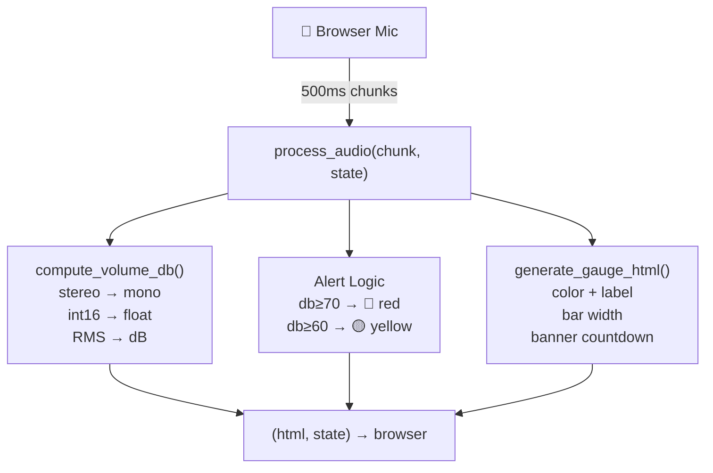
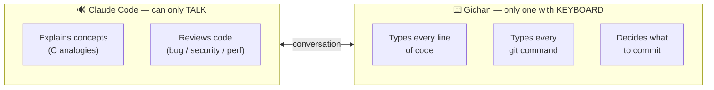

# Sentinel — Real-time Voice Volume Monitor

[](https://python.org)
[](https://gradio.app)
[](https://numpy.org)
[](https://claude.ai/code)

A browser-based microphone monitor that computes dB levels in real-time and displays a color-coded volume gauge with persistent alert banners.

> **This is not vibe-coded.** Every line was typed by a human. Claude Code served as a **senior pair-programmer who can only talk — never touch the keyboard.** All code, all git commands, all terminal input was written by [Gichan](https://github.com/bookseal). See [How This Was Built](#how-this-was-built) below.

---

## What It Does

| Feature | Description |
|---------|-------------|
| **Real-time streaming** | Browser mic → 500ms chunks → Python callback |
| **dB calculation** | Stereo→mono, int16 normalization, RMS, dB conversion |
| **Color-coded gauge** |  < 60dB <  < 70dB <  |
| **Persistent alert** | Banner stays 10 seconds after loud sound. Red > yellow priority |
| **Per-session state** | Each browser tab is independent (no cross-talk via `gr.State`) |

---

## Architecture



Each callback is **stateless** except for `SessionState` (managed via `gr.State`), which stores alert expiration timestamps. No global variables — each browser tab gets independent state, like C's thread-local storage.

---

## How This Was Built

### Pair Programming with Claude Code — but I hold the keyboard

This project follows a strict **pair programming** model:



**What this means concretely:**
- **Every `git commit`, `git push`, `python app.py`** — typed by me in my terminal
- **Every line of `app.py`** — typed by me in VS Code
- **Claude's role** — explain concepts (using C analogies since I have 2+ years of C), provide scaffolds to study, review code for bugs, answer "why?" questions
- **My rule** — never commit code I can't explain line by line

### Why this matters

Most AI-assisted portfolios are ambiguous: "Did the AI write it, or did the human?" This project has a clear answer:

| Role | Who |
|------|-----|
| Architecture decisions | Me (with Claude's input) |
| Typing code | **Me — always** |
| Typing git commands | **Me — always** |
| Understanding each line | **Me — before every commit** |
| Code review | Claude (via custom review skill) |
| Bug explanations | Claude (I ask "why?", it explains) |
| Framework comparison (Gradio vs Streamlit) | Both (I asked, Claude analyzed, I decided) |

**Evidence:** Every PR has a "Learning Notes" section written by me, documenting what I understood, what surprised me, and what mistakes I made. These are not generated — they reflect my actual learning moments.

---

## Learning Journey

### The Build-Up — each row is one merged PR

| PR | What was built | What I learned |
|----|---------------|----------------|
| [#10](../../pull/10) |  Project scaffolding | `.gitignore` doesn't ignore already-tracked files — need `git rm --cached`. `pip freeze` captures transitive deps |
| [#14](../../pull/14) |  Mic streaming + metadata | Callback = C function pointer. `inputs`/`outputs` decouple event source from data source. Browser sends stereo int16 at 48kHz |
| [#17](../../pull/17) |  Real-time dB calculation | `numpy.mean()` silently converts int16→float64, breaking dtype checks. Fix: save `original_dtype` before operations |
| [#18](../../pull/18) |  dtype normalization bug | Caught by code review: `np.iinfo(audio.dtype)` fails after `.mean()` changes dtype. One-line fix |
| [#19](../../pull/19) |  HTML gauge + thresholds | f-string HTML generation. `min(max(x,0),100)` = clamp. CSS `transition` for animation. Pure function = testable |
| #20 |  Persistent alert banner | `gr.State` = per-session state (C thread-local). `time.time()` > countdown int. Tuple return for multiple outputs |

### Key Decisions

| Decision | Chosen | Alternative | Why |
|----------|--------|-------------|-----|
| **Framework** |  | Streamlit | Native `streaming=True` for real-time mic. Streamlit needs third-party WebRTC |
| **dB math** |  | Cloud API | $0 cost, <10ms, no network. Volume = signal math, not AI |
| **State** |  | Global variable | Per-session isolation. Global var = cross-talk between tabs |
| **CSS** | Inline | Separate file | Single-file simplicity for small components |
| **Dev pattern** | Stub first | Write full logic | `return 0.0` → test wiring → fill logic. Bugs stay localized |

### Development Workflow

```
1. Goal       — I state what to build (one sentence)
2. Scaffold   — Claude shows a starting point (I read, don't copy blindly)
3. Understand — I ask "why?" on anything unclear
4. Type       — I write the code myself, line by line
5. Test       — python app.py after every change
6. Commit     — only code I can explain
7. Review     — Claude runs 4-axis review (bug / security / perf / convention)
8. Merge      — squash merge, close issue with learning summary
```

> **The keyboard never leaves my hands.** Claude is the senior who reviews over my shoulder and explains when I'm stuck — but never grabs the mouse.

---

## Tech Stack

| Component | Technology | Why |
|-----------|-----------|-----|
|  | Language | Cutting-edge stable, full ecosystem |
|  | UI Framework | Native audio streaming, no JS needed |
|  | Audio Math | RMS/dB in <10ms, zero cost |
|  | Version Control | Issue→PR→Review→Merge workflow |
|  | Pair Programming | Senior co-pilot (talk only, no keyboard) |
|  | Browser Testing | CDP mode, visual verification |

---

## Quick Start

```bash
git clone https://github.com/bookseal/sentinel-real-time-cognitive-assistant.git
cd sentinel-real-time-cognitive-assistant
python3 -m venv venv
source venv/bin/activate
pip install -r requirements.txt
python app.py
# Open http://localhost:7860 — grant microphone permission
```

---

## Project Structure

```
sentinel-real-time-cognitive-assistant/
├── app.py               # Main app — 3 functions, ~95 lines
│                        #   generate_gauge_html()  — HTML rendering
│                        #   compute_volume_db()    — audio → dB
│                        #   process_audio()        — orchestrator
├── requirements.txt     # gradio + numpy (49 packages via pip freeze)
├── CLAUDE.md            # Project conventions + balanced workflow rules
├── .claude/skills/
│   ├── review/          # 4-axis code review (bug/security/perf/convention)
│   └── fix-issue/       # Issue-driven debugging workflow
└── .gitignore
```

Code follows [norminette-inspired conventions](CLAUDE.md): max 7 functions/file, max 30 lines/function, single responsibility, flat over nested.

---

## Roadmap

| Version | Milestone | Status |
|---------|-----------|--------|
|  | Volume gauge + persistent alert | **Current** |
|  | VAD-gated emotion detection (Silero + OpenAI) | Planned |
|  | Full pipeline + deployment | Planned |

---

## Background

Built on [42 Seoul](https://42seoul.kr) foundations — 2+ years of C, from `malloc` to `pthread`. This project is a deliberate transition from systems programming to full-stack Python, documenting the journey from `printf("hello")` to real-time audio streaming in the browser.

The entire git history — from empty repo to working app — is preserved as a learning artifact. Each issue, PR, and commit message tells the story of one developer learning by building, with a senior AI pair-programmer who was only allowed to talk.
