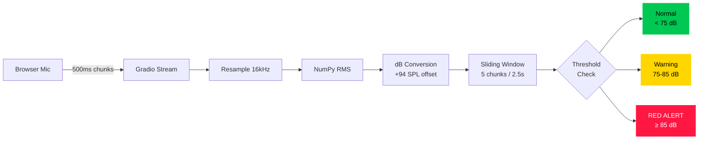
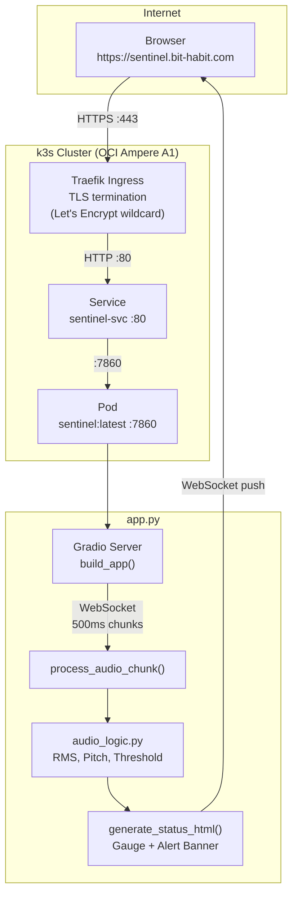

# Sentinel: Real-time Cognitive Assistant

[](https://sentinel.bit-habit.com)
[](https://sentinel.bit-habit.com)
[](https://python.org)
[](https://sentinel.bit-habit.com)

A real-time voice monitor that detects vocal escalation and alerts participants before conversations get out of hand. Built with **local-first computation** — no cloud API needed for core detection.

**Live at https://sentinel.bit-habit.com**

> **메가존클라우드 AI 에이전트 해커톤 1등 수상**  
> 인포뱅크 CTO 주간 멘토링을 통해 비즈니스 관점에서 기술 선택을 지속 검증하며 고도화 중

---

## Why This Exists

부부나 동료 간의 소통에서 감정적 과열(고성, 흥분)이 발생해도 당사자들은 인지하기 어렵고, 제3자가 지적하기에는 사회적 마찰이 큼. 기존 소통 도구에는 이러한 **'실시간 인지 피드백'**이 전무함.

Sentinel은 AI가 제3자의 입장에서 실시간으로 대화의 톤과 볼륨을 모니터링하여, 과열 시점에 즉각적인 경고를 제공하는 **인지 어시스턴트**입니다.

---

## Design Philosophy: Cost-First Engineering

처음부터 고비용 LLM API를 쓰지 않고, 로컬 NumPy 연산으로 핵심 기능을 먼저 구현하는 **비즈니스 우선순위 접근법**을 택했습니다.

| Factor | Plan A: Cloud Speech API | Plan B: Local NumPy (채택) |
|---|---|---|
| **Cost** | ~$0.06/min | **$0.00** |
| **Latency** | ~200ms (network round-trip) | **< 10ms** |
| **Privacy** | Audio sent to third party | **Audio stays on device** |
| **Availability** | Depends on network + API uptime | **Always available** |

Volume detection은 AI가 필요하지 않습니다 — 순수 신호 처리 수학입니다. LLM API는 감정 분석 등 실제로 AI가 필요한 단계(v0.2+)에서만 도입합니다.

---

## Current State: v0.1 (Volume + Pitch Guard)

### Features

- **Real-time volume (dB) gauge** — green / yellow / red color-coded
- **10-second persistent alert banner** — 경고가 즉시 사라지지 않고 10초간 유지
- **Pitch detection (FFT)** — 기본 주파수(F0) 추출, 85~400Hz 음성 범위 필터링
- **Adaptive sensitivity slider** (0.5~2.0) — 조용한 회의실 vs 카페 환경 대응
- **Mobile vibration** — 경고 시 `navigator.vibrate([200,100,200])` 패턴
- **Zero cloud API calls** — 모든 연산이 로컬

### Audio Pipeline



### Sliding Window Design

| Design Decision | Value | Rationale |
|---|---|---|
| Window size | 5 chunks (2.5s) | 기침/문 닫는 소리(< 500ms)는 1/5 비중 → 임계값 미달. 실제 고성(1~2초 지속)은 평균 초과 |
| `-inf` filtering | Silence excluded | 간헐적 무음이 경고를 마스킹하지 않도록 |
| Alert persistence | 10 seconds | 사용자가 경고를 인지하고 목소리를 낮출 시간 확보 |
| Red > Yellow priority | No downgrade mid-alert | Red alert 중 Yellow 레벨 소리가 나도 Red 유지 |

### dB Reference Points

| dB SPL | Real-World Equivalent |
|---|---|
| 30 | 속삭임, 조용한 도서관 |
| 60 | 일반 대화 |
| 75 | 큰 목소리, 바쁜 식당 (**Warning threshold**) |
| 85 | 고성, 교통 소음 (**Red Alert threshold**, OSHA 기준) |
| 100 | 록 콘서트 |

---

## Architecture

### Request Lifecycle



### Real-time Streaming Flow


---

## Roadmap

Sentinel is built incrementally. Each version adds a layer of intelligence.

| Version | Milestone | Status |
|---------|-----------|--------|
| **v0.0** | Volume gauge + 10s persistent alert banner | **Deployed** |
| **v0.1** | Pitch detection (FFT) + adaptive sensitivity + mobile vibration | **Deployed** |
| v0.2 | VAD-gated emotion detection (Silero + OpenAI Realtime API) | Planned |
| v0.3 | Speaker diarization + color-coded transcript | Planned |
| v0.4 | Claim detection + fact-checking (Tavily) | Planned |
| v0.5 | Edge AI migration (local vLLM, $0 token cost) | Planned |
| v1.0 | Slack/Zoom alerts + autonomous verbal mediation | Planned |

---

## Tech Stack

| Layer | Technology | Why |
|-------|-----------|-----|
| Frontend | Gradio 4.0+ | Native Python streaming, rapid prototyping |
| Audio Math | NumPy | RMS/dB/FFT calculation, zero dependencies, < 10ms |
| Container | Docker + Python 3.10 slim | Lightweight, reproducible |
| Orchestration | K3s on Oracle OCI | Free tier, production Kubernetes |
| Ingress | Traefik + cert-manager | Auto TLS via Let's Encrypt wildcard |
| GitOps | ArgoCD (cluster-level) | Declarative deployment, auto-sync |

---

## Project Structure

```
sentinel-real-time-cognitive-assistant/
├── app.py               # Gradio app — mic streaming + volume/pitch gauge + alert
├── audio_logic.py       # RMS, dB, pitch (FFT), threshold logic
├── vad.py               # Silero Voice Activity Detection (future)
├── audio_buffer.py      # Circular buffer for speech chunks (future)
├── requirements.txt     # gradio, numpy
├── Dockerfile           # Python 3.10 slim + ffmpeg
├── CLAUDE.md            # Claude Code project instructions
├── k8s/
│   ├── deployment.yaml  # Pod spec (resources, probes)
│   ├── service.yaml     # ClusterIP :80 → :7860
│   ├── ingress.yaml     # Traefik → sentinel.bit-habit.com
│   └── secret.yaml.example
└── docs/
    ├── guide-v0.0-volume-gauge.md   # Build, deploy, traffic flow guide
    ├── guide-v0.1-pitch-guard.md    # Volume + Pitch deep dive
    └── guide-request-lifecycle.md   # Full request trace: browser → HTML
```

---

## Quick Start

```bash
# Clone
git clone git@github.com:bookseal/sentinel-real-time-cognitive-assistant.git
cd sentinel-real-time-cognitive-assistant

# Run locally
pip install -r requirements.txt
python app.py
# Open http://localhost:7860

# Or via Docker
docker build -t sentinel:latest .
docker run -p 7860:7860 sentinel:latest
```

### Deploy to K3s

```bash
docker build -t sentinel:latest .
docker save sentinel:latest | sudo k3s ctr images import -
kubectl rollout restart deployment/sentinel
```

---

## Git Workflow

| Branch pattern | Purpose |
|---------------|---------|
| `main` | Production — deployed to K3s |
| `feature/*` | New features (`feature/persistent-alert`) |
| `fix/*` | Bug fixes |
| `docs/*` | Documentation only |

**Tags** follow [Semantic Versioning](https://semver.org/): `v0.0.0` → `v0.1.0` → ...  
**Commits** follow [Conventional Commits](https://www.conventionalcommits.org/): `feat:`, `fix:`, `docs:`, `chore:`

---

## Documentation

| Document | Description |
|----------|-------------|
| [v0.0 Guide](docs/v0.0-guide.md) | Build, deploy, traffic flow, k8s concepts for beginners |
| [v0.1 Flow](docs/v0.1-flow.md) | Volume + Pitch deep dive — RMS math, sliding window, edge cases |
| [Request Lifecycle](docs/request-lifecycle.md) | Full request trace from browser to HTML response |

---

Built on 42 Seoul foundations. Deployed via K3s on Oracle OCI.