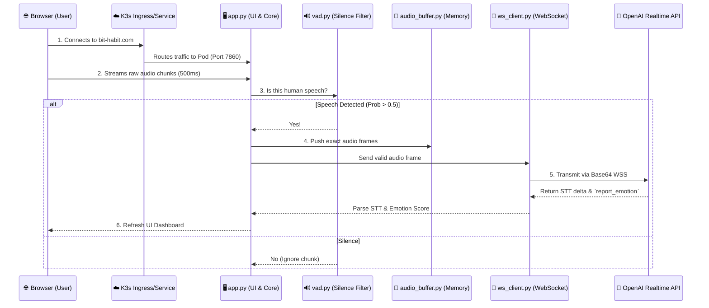

# 🛡️ Sentinel: Real-time Cognitive Assistant

> **"Converting conversational noise into verified signal through emotional and factual surveillance."**

## 1. Project Goals (The North Star)

The primary objective of **Sentinel** is to serve as an objective, third-party observer in high-stakes environments.

- **Enforce Rationality**: Monitor and alert when emotions override logic.
- **Ensure Truth**: Cross-reference verbal claims with real-time data.
- **Leverage Knowledge**: Act as a "Technical Master" assistant that filters irrelevant data.
- **Infrastructure Excellence**: Deploy as a resilient microservice on the `bit-habit` ecosystem.

---

## 2. Current Status: Phase 00 — Minimal Volume Gauge

Phase 00 is **live** at [sentinel.bit-habit.com](https://sentinel.bit-habit.com).

A stripped-down proof-of-concept: mic button + real-time volume (dB) gauge.
No AI, no cloud API — just Gradio + NumPy running on k3s.

- **What it does**: Streams browser mic → computes RMS dB → renders a color-coded volume bar
- **Stack**: `gradio` + `numpy` only (no torch, no VAD)
- **Why**: Validate the end-to-end pipeline (code → Docker → k3s → browser) before adding complexity

> For full details — build, deploy, traffic flow, and commands — see
> **[docs/phase-00-guide.md](docs/phase-00-guide.md)**

---

## 3. MVP Goal: Emotional Sentinel

For the Minimum Viable Product (MVP), we focus strictly on **Vocal Arousal Monitoring**.

- **The Red Light**: When the system detects high-arousal emotions (anger, extreme stress), it triggers a visual "Red Light" alert.
- **Objective**: Prevent "Emotional Hijacking" and maintain professional integrity in meetings.

---

## 4. Tech Stack (The Architecture)

Our stack is chosen for **Operational Excellence** and **High-Performance Streaming**.

| Layer              | Technology              | Reason                                               |
| :----------------- | :---------------------- | :--------------------------------------------------- |
| **Frontend**       | **Gradio**              | Rapid prototyping & native Python streaming support. |
| **Backend**        | **Python (FastAPI)**    | High-concurrency support for WebSocket connections.  |
| **AI Engine**      | **OpenAI Realtime API** | Ultra-low latency speech-to-sentiment processing.    |
| **Orchestration**  | **LangGraph**           | Complex state management for agentic workflows.      |
| **Infrastructure** | **k3s on Oracle OCI**   | Resilient hosting at `sentinel.bit-habit.com`.       |

---

## 5. Git Workflow Structure

We follow the **"Feature Branch"** model to maintain codebase integrity.

1. **`main`**: Production-ready code. Auto-deployed to k3s.
2. **`develop`**: Integration branch for new features.
3. **`feature/name`**: Individual task branches (e.g., `feature/emotion-logic`).

---

## 6. Testing Methodology

- **Unit Testing**: Test the `Emotion Scoring` logic with recorded audio clips.
- **Integration Testing**: Verify WebSocket latency between Gradio and OpenAI.
- **Stress Test**: Role-play a heated debate to see if the "Red Light" triggers correctly.
- **Frugality Check**: Monitor token usage to ensure 5-year FIRE goals are maintained.

---

## 7. Detailed AI Agent TODO List (Phase-by-Phase)

### Phase 1: Sensory Input Layer (STT & VAD)

1. **Initialize Audio Stream**: Implement `gr.Audio(streaming=True)` in Gradio to capture 500ms chunks.
2. **Local VAD Implementation**: Integrate **Silero VAD** on the local machine. The agent must only "wake up" and send data when actual human speech is detected.
3. **WebSocket Handshake**: Establish a secure, bidirectional WebSocket connection to `api.openai.com/v1/realtime`.
4. **Buffer Management**: Create a circular buffer to manage audio chunks and prevent memory leaks.

#### Architectural Flow: Data Pipeline

When a user connects to `https://sentinel.bit-habit.com`, the audio data travels through the following architectural layers before the UI is updated with STT and emotion scores.

**Step-by-Step Breakdown:**

1. **🌐 Cloud Infrastructure Entry (`k8s/` & `Dockerfile`)**
   Traffic reaching `sentinel.bit-habit.com` is intercepted by the Kubernetes (K3s) Ingress. The `ingress.yaml` and `service.yaml` route the external HTTPS requests into the secure Docker container deployed via `deployment.yaml`.
2. **🖥️ Frontend UI & Audio Ingestion (`app.py`)**
   Serving as the control center, `app.py` renders the Gradio interface. Once the user grants microphone access, it continuously captures 500ms audio chunks (PCM format) and manages the overarching state of the application.
3. **🔊 Voice Activity Detection (`vad.py`)**
   Acting as the analytical gatekeeper, the Silero-VAD model inspects every incoming chunk. It filters out silence and background noise, only allowing data to proceed if the speech probability exceeds the 0.5 threshold.
4. **💾 Memory Management (`audio_buffer.py`)**
   Valid speech chunks are safely stored inside a thread-safe Circular Queue buffer. This prevents memory overflow during long sessions by retaining only the recent context (e.g., 15 seconds capacity) and discarding old data.
5. **🚀 OpenAI API Communication (`ws_client.py`)**
   Concurrently, valid audio frames are converted to Base64 and pumped directly into a persistent WebSocket connection hooked specifically to the OpenAI Realtime API.
6. **🔄 Instantaneous UI Updates**
   As the user speaks, the `ws_client.py` receives async events (like `response.audio_transcript.delta` and the custom tool call `report_emotion`). `app.py` parses these values to immediately update the real-time textual transcript and the visual Emotional Arousal gauge on the dashboard.

### Phase 2: Cognitive Processing Layer (Sentiment & Intensity)

1. **System Prompt Engineering**: Design a specialized prompt for the "Sentinel Agent".
   - _Instruction_: "Monitor the input stream for signs of anger or aggression. Output JSON: `{ "score": 0.0-1.0, "reason": "string" }`".
2. **Multimodal Data Fusion**:
   - **Textual Sentiment**: Use the LLM to analyze transcript semantic intensity.
   - **Audio Metadata**: Extract RMS (volume) and Pitch variance from the raw buffer.
3. **Intensity Logic ($E$)**:
   $$E = \omega_1 \cdot \Delta P + \omega_2 \cdot V_{rms} + \omega_3 \cdot S_{agg}$$
   - _Intuitive Meaning_: Emotional Intensity $E$ is the weighted sum of Pitch Variance, RMS Volume, and Sentiment Aggression.
4. **Smoothing Algorithm**: Implement a 3-second sliding window average for $E$ to stabilize the visual output.

### Phase 3: Action & Feedback Layer (The Red Light)

1. **Threshold Triggering**: Define $\theta_e$ (Emotion Threshold).
   - If $E > 0.7$, trigger the **Red Light**.
   - If $0.5 < E \le 0.7$, trigger a **Yellow Light**.
2. **Reactive UI**: Create an HTML/CSS component in Gradio that updates background color in real-time via WebSocket events.
3. **Alert Logging**: Store "Red Light" events with timestamps for post-meeting review.

### Phase 4: Cloud-Native Infrastructure & Deployment (k3s)

1. **Dockerization**: Create a multi-stage `Dockerfile` optimized for Python and audio processing libraries.
2. **K8s Manifests**: Write Deployment and Service YAMLs for the `sentinel` namespace.
3. **Helm Chart Creation**: Package the application into a Helm chart for version-controlled deployments.
4. **Ingress Configuration**:
   - Configure **Traefik IngressRoute** for `sentinel.bit-habit.com`.
   - Enable **WebSocket support** and **Middleware** (Rate-limit, Retry).
5. **TLS Automation**: Use `cert-manager` to automate Wildcard TLS for the custom domain.
6. **GitOps Integration**: Set up a GitHub Action to auto-deploy to the k3s cluster on every push to `main`.
7. **Liveness/Readiness Probes**: Implement health check endpoints to ensure 99.9% uptime.

---

© 2026 Gichan Lee. Deployed via k3s. Served by Traefik.
