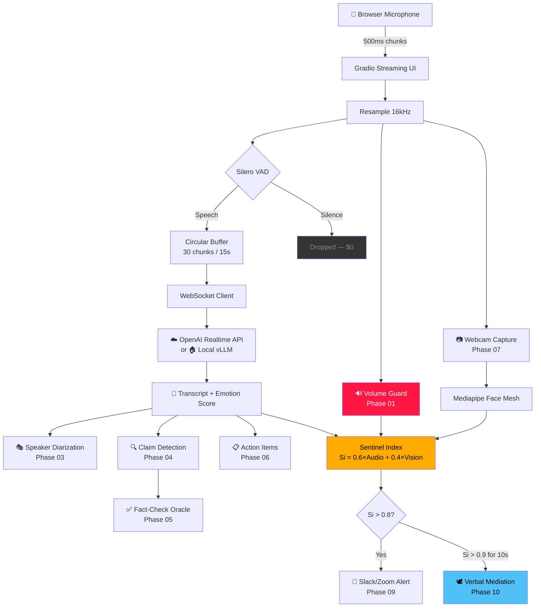

# 🛡️ Sentinel: Real-time Cognitive Assistant

[](https://sentinel.bit-habit.com)
[](https://sentinel.bit-habit.com)
[](https://python.org)
[](https://gradio.app)

> **"Converting conversational noise into verified signal through emotional and factual surveillance."**

Sentinel is a real-time meeting intelligence system that monitors vocal arousal, detects factual claims, verifies them against the web, and intervenes when conflict escalates — all while minimizing cloud API costs through local-first computation.

---

## Live Deployment

**🌐 https://sentinel.bit-habit.com**

Sentinel runs as a containerized microservice on **K3s (Oracle OCI)**, exposed via Traefik Ingress with automatic TLS. Connect your microphone and the system begins analyzing in real-time.

```
Browser → K3s Ingress (Traefik + TLS) → Sentinel Pod (port 7860) → Gradio UI
```

---

## Architecture Overview



---

## The 10 Phases

Sentinel is built in 10 incremental phases, each on its own feature branch. The philosophy: **local computation first, cloud only when necessary**.

### Phase 01 — 🔊 Local Volume Guard
> **Branch**: `feature/phase-01-volume-guard`

Detects shouting using NumPy RMS → dB conversion. Zero cloud calls, zero cost, sub-10ms latency.

| Key | Value |
|-----|-------|
| Shout Threshold | 85 dB SPL |
| Sliding Window | 5 chunks (2.5s) |
| Cost | **$0.00** |
| Core File | [`audio_logic.py`](audio_logic.py) |

---

### Phase 02 — 🧠 VAD-Gated Emotion Guard
> **Branch**: `feature/phase-02-emotion-guard`

Silero VAD gates the OpenAI API — only speech gets sent, silence costs $0. Includes a 1-second grace period to prevent cutting off mid-sentence.

| Key | Value |
|-----|-------|
| VAD Threshold | P(speech) > 0.5 |
| Grace Period | 2 chunks (~1s) |
| Emotion Output | Arousal 0.0–1.0 via `report_emotion` tool |
| Core Files | [`vad.py`](vad.py), [`ws_client.py`](ws_client.py) |

---

### Phase 03 — 🎭 Speaker Diarization
> **Branch**: `feature/phase-03-diarization`

Identifies **who** is speaking and renders color-coded chat bubbles. Users can assign custom names via the Speaker Legend panel.

| Key | Value |
|-----|-------|
| Speaker Colors | 5 distinct colors (blue, green, orange, pink, purple) |
| Name Assignment | Manual via UI (e.g., `speaker_0` → "Gichan") |
| Core File | [`app.py`](app.py) — `SPEAKER_COLORS`, `update_speaker_name()` |

---

### Phase 04 — 🔍 Claim Detection (LangGraph)
> **Branch**: `feature/phase-04-claim-detection`

Filters conversation to find **checkable facts** using regex pattern matching — no LLM needed. Only high-confidence claims (≥0.6) trigger highlighting.

| Key | Value |
|-----|-------|
| Pattern Categories | 6 (numbers, dates, statistics, absolutes, named entities, factual assertions) |
| Confidence Formula | `0.5 + matched_patterns × 0.15` |
| False Positive Guard | 4 small-talk rejection patterns |
| Core File | [`agent/claim_detector.py`](agent/claim_detector.py) |

---

### Phase 05 — ✅ Fact-Check Oracle (Tavily)
> **Branch**: `feature/phase-05-fact-check`

Detected claims are verified against the web using **Tavily AI Search** + **GPT-4o-mini** as a judge. Returns: Verified, False, or Disputed.

| Key | Value |
|-----|-------|
| Search Engine | Tavily (LLM-ready content) |
| Judge Model | GPT-4o-mini ($0.15/1M tokens) |
| Target SLA | < 5 seconds |
| Core Files | [`tools/search.py`](tools/search.py), [`agent/verifier.py`](agent/verifier.py) |

---

### Phase 06 — 📋 Action Item Extraction
> **Branch**: `feature/phase-06-action-items`

Automatically extracts commitments ("I will send the report by Friday") from live conversation. Exports as downloadable `.md` file.

| Key | Value |
|-----|-------|
| Commitment Patterns | 8 regex patterns |
| Vague Rejection | "I'll do it later" → filtered out |
| Export | Markdown table with Task, Owner, Deadline |
| Core File | [`agent/summarizer.py`](agent/summarizer.py) |

---

### Phase 07 — 📷 Multi-modal Vision Guard
> **Branch**: `feature/phase-07-vision`

Webcam detects facial stress (brow furrow, jaw clench, eye squint) using **Mediapipe Face Mesh** — 100% local, no frames sent externally. Fused with audio into the **Sentinel Index**.

| Key | Value |
|-----|-------|
| Landmarks | 468 (Mediapipe Face Mesh) |
| Stress Formula | `0.4×brow + 0.35×jaw + 0.25×eye` |
| Sentinel Index | `Si = 0.6×Audio + 0.4×Vision` |
| Core File | [`vision/face_monitor.py`](vision/face_monitor.py) |

---

### Phase 08 — 🏠 Edge AI ($0 Token Migration)
> **Branch**: `feature/phase-08-edge-ai`

Switch from OpenAI cloud to local **vLLM** (Llama-3 8B) or **Ollama** with one environment variable. Same WebSocket interface, zero variable cost.

| Key | Value |
|-----|-------|
| Switch | `LLM_PROVIDER=local` |
| Local Model | Meta-Llama-3-8B-Instruct |
| GPU Requirement | 1× NVIDIA (8–16 GB VRAM) |
| Core Files | [`k8s/vllm-deployment.yaml`](k8s/vllm-deployment.yaml), [`ws_client.py`](ws_client.py) |

---

### Phase 09 — 🔔 Ecosystem Integration (Slack/Zoom)
> **Branch**: `feature/phase-09-integration`

When the Sentinel Index exceeds threshold, alerts fire to **Slack** and **Zoom** automatically. 5-minute cool-down prevents spam.

| Key | Value |
|-----|-------|
| Channels | Slack Incoming Webhook, Zoom Chat API |
| Red Alert Threshold | Si ≥ 0.8 |
| Critical Threshold | Si ≥ 0.9 |
| Cool-down | 300 seconds (5 min) |
| Core File | [`integration/dispatcher.py`](integration/dispatcher.py) |

---

### Phase 10 — 🕊️ Autonomous Verbal Mediation
> **Branch**: `feature/phase-10-mediation`

When conflict escalates beyond 0.9 for 10+ seconds, Sentinel generates a calming de-escalation message via **OpenAI TTS** and plays it to the meeting. Users have a "Silence Sentinel" override button.

| Key | Value |
|-----|-------|
| Trigger | Si > 0.9 sustained for 10s |
| TTS Voice | `nova` (calm, authoritative) at 0.9× speed |
| Cool-down | 120 seconds between interventions |
| Safety | "Silence Sentinel" button (user override) |
| Core File | [`agent/mediator.py`](agent/mediator.py) |

---

## Tech Stack

| Layer | Technology | Role |
|-------|-----------|------|
| **Frontend** | Gradio 4.0+ | Real-time streaming UI with audio input |
| **Audio AI** | Silero VAD v5 | Local voice activity detection (CPU) |
| **Speech** | OpenAI Realtime API | Transcription + emotion analysis |
| **Vision** | Mediapipe Face Mesh | Local facial stress detection |
| **Search** | Tavily AI Search | LLM-ready web search for fact-checking |
| **Agent** | LangGraph (concept) | Stateful claim detection pipeline |
| **LLM** | GPT-4o-mini / Llama-3 8B | Judge node, action extraction, mediation scripts |
| **TTS** | OpenAI TTS (nova) | Verbal de-escalation audio |
| **Infra** | K3s on Oracle OCI | Production Kubernetes cluster |
| **Ingress** | Traefik + TLS | HTTPS routing at `sentinel.bit-habit.com` |
| **Alerts** | Slack / Zoom Webhooks | External notification channels |

---

## Quick Start

```bash
# 1. Clone
git clone git@github.com:bookseal/sentinel-real-time-cognitive-assistant.git
cd sentinel-real-time-cognitive-assistant

# 2. Configure
echo "OPENAI_API_KEY=sk-..." > .env

# 3. Run
docker-compose up -d --build
docker compose logs -f    # Find the gradio.live link

# 4. Open browser → allow microphone → start speaking
```

---

## Project Structure

```
sentinel-real-time-cognitive-assistant/
├── app.py                    # Main Gradio UI + audio processing pipeline
├── audio_logic.py            # Phase 01: RMS dB calculation, volume thresholds
├── audio_buffer.py           # Thread-safe circular buffer (30 chunks)
├── vad.py                    # Silero VAD wrapper with grace period
├── ws_client.py              # OpenAI Realtime API WebSocket client
├── agent/
│   ├── claim_detector.py     # Phase 04: Regex-based claim classification
│   ├── verifier.py           # Phase 05: Tavily + GPT-4o-mini fact-check
│   ├── summarizer.py         # Phase 06: Action item extraction
│   └── mediator.py           # Phase 10: TTS verbal mediation
├── tools/
│   └── search.py             # Phase 05: Tavily AI Search wrapper
├── vision/
│   └── face_monitor.py       # Phase 07: Mediapipe facial stress detection
├── integration/
│   └── dispatcher.py         # Phase 09: Slack/Zoom alert dispatcher
├── k8s/
│   ├── deployment.yaml       # Pod spec with health probes
│   ├── service.yaml          # ClusterIP (port 80 → 7860)
│   ├── ingress.yaml          # Traefik ingress for sentinel.bit-habit.com
│   ├── vllm-deployment.yaml  # Phase 08: Local vLLM/Ollama deployment
│   └── secret.yaml.example   # Template (real secret is .gitignored)
├── docs/
│   ├── PLAN.md               # Full 10-phase execution blueprint
│   └── phase-XX-flow.md      # Per-phase 3-chapter engineering guides
├── Dockerfile
├── docker-compose.yml
└── requirements.txt
```

---

## Git Workflow

| Branch | Purpose |
|--------|---------|
| `main` | Production — mirrors K3s deployment |
| `develop` | Integration staging |
| `feature/phase-XX-*` | Phase implementation branches |

**Commit format**: [Conventional Commits](https://www.conventionalcommits.org/) — `type(scope): description`

---

## Development Philosophy

> *"Cost is a technical debt. Minimize token burn through local logic."*

1. **Local First**: Compute locally (NumPy, Silero, Mediapipe) before calling any cloud API
2. **Frugal Architecture**: VAD-gate every API call — never send silence to OpenAI
3. **Progressive Enhancement**: Each phase adds capability without breaking previous layers
4. **Graceful Degradation**: Missing API keys? The system falls back to local-only mode

---

© 2026 Gichan Lee. Built on 42 Seoul Foundations. Deployed via K3s on Oracle OCI. Served by Traefik.
