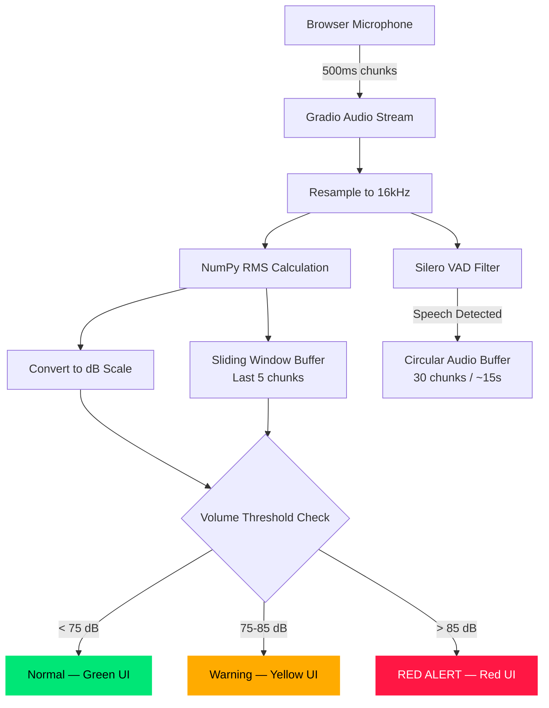

# Phase 01: Sensory Foundation — Local Volume Guard

## Data Flow

## Key Design Decisions

| Decision | Rationale |
|----------|-----------|
| Local RMS via NumPy | $0.00 cost, <10ms latency vs ~$0.06/min cloud |
| dB SPL approximation | Human-readable scale (85 dB = shouting threshold) |
| 5-chunk sliding window | Prevents single-frame false positives |
| Zero network calls | All computation is local — no WebSocket or API usage |

## RMS Formula

$$X_{rms} = \sqrt{\frac{1}{n} \sum_{i=1}^{n} x_i^2}$$

Converted to dB: `dB_SPL ≈ 20 * log10(RMS) + 94`

## Files Modified

| File | Change |
|------|--------|
| `audio_logic.py` | New — `get_rms_db()`, `check_volume_threshold()` |
| `app.py` | Volume guard integration, Red Alert UI banner, dB meter |
