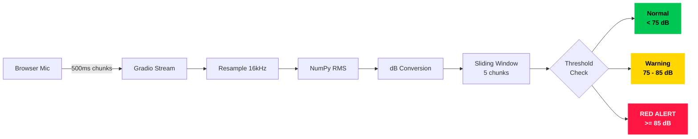
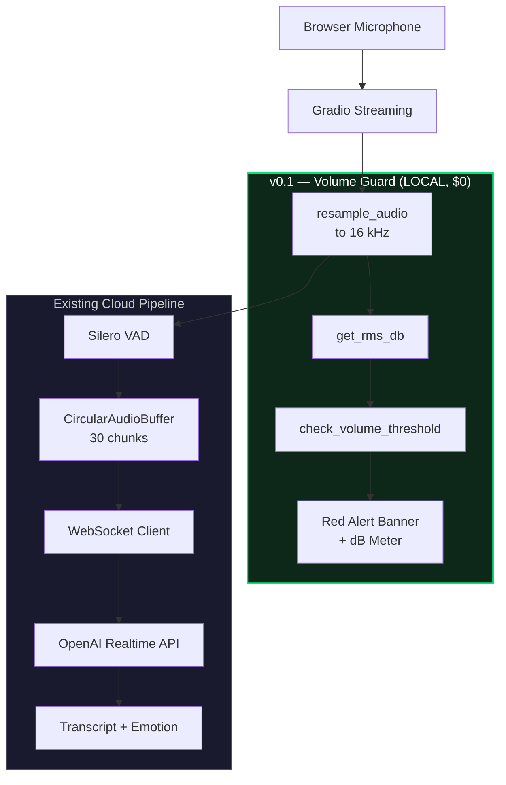
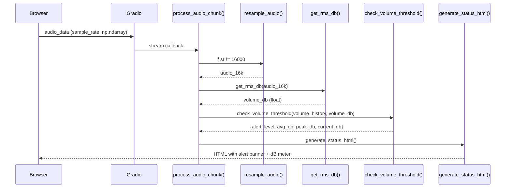
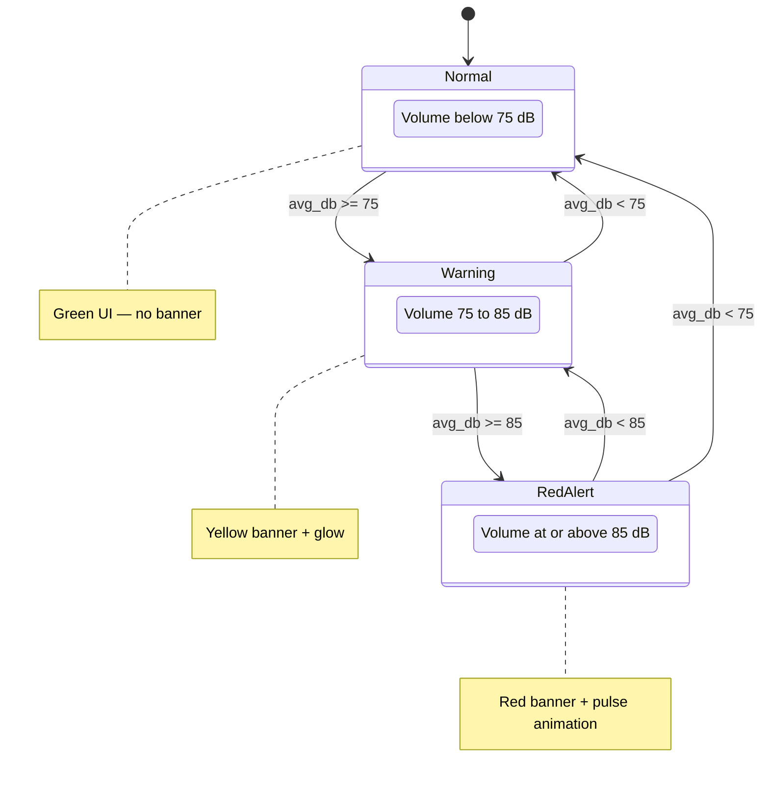
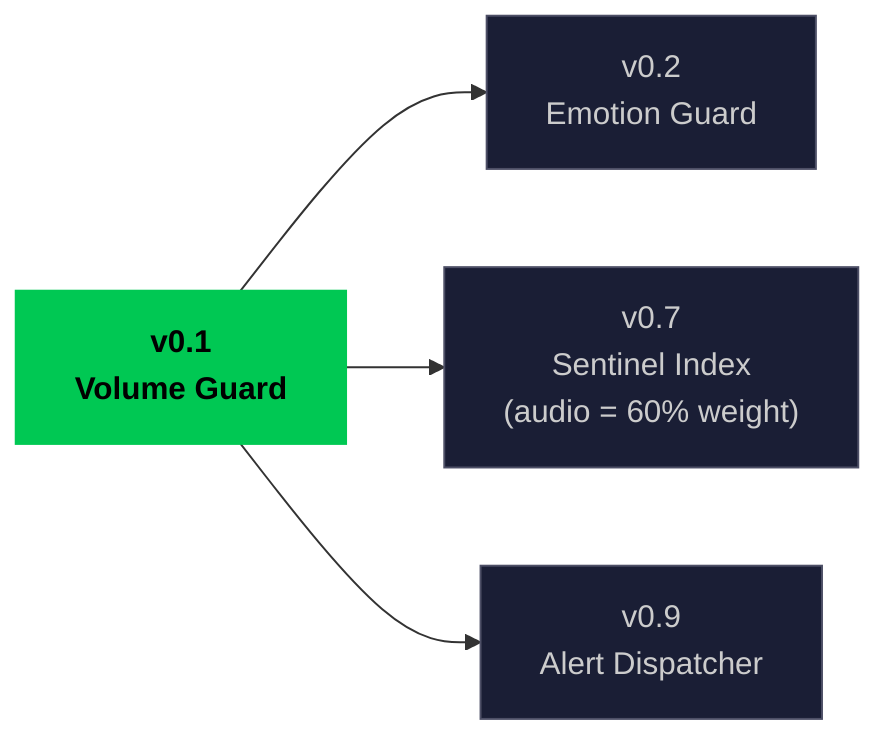

# v0.1: Sensory Foundation — Local Volume + Pitch Guard

> Detect raised voices and vocal pitch changes in real-time using only NumPy — zero network calls, zero cloud cost, sub-10ms latency. Includes adaptive sensitivity for noisy environments and persistent 5-second alerts with mobile vibration.

---

## Chapter 1: The 1-Minute Overview

### What This Phase Does

Sentinel processes each 500ms audio chunk through a local NumPy RMS calculation to measure volume in decibels. If the average volume exceeds 85 dB over a sliding window of 5 chunks, the UI triggers a RED ALERT banner. This entire computation costs $0.00 and runs in under 10ms — no cloud API is ever called.

### The Big Picture



### In Numbers

| Metric | Value | Notes |
|---|---|---|
| Shout threshold | 85.0 dB | Triggers RED ALERT — aligns with OSHA hearing-damage limit |
| Warning threshold | 75.0 dB | Triggers yellow WARNING — loud conversational voice |
| Sliding window | 5 chunks (2.5 s) | Prevents false positives from transient spikes |
| Sample rate | 16 000 Hz | Standard speech-band rate after resampling |
| Chunk duration | 500 ms | Gradio streaming interval |
| Processing latency | < 10 ms | Pure NumPy math, no I/O |
| Cloud API cost | $0.00 | All computation is local |
| Alternative cloud cost | ~$0.06 / min | What a speech-level cloud API would charge |

---

## Chapter 2: The 10-Minute Deep Dive

### Architecture in Context



The Volume Guard path (left subgraph) runs entirely on the local machine. It has zero dependency on network connectivity and operates in parallel with the existing cloud pipeline.

### Step-by-Step Runtime Flow



### Technology Spotlight: RMS and the Decibel Scale

**RMS (Root Mean Square)** measures the average power of an audio waveform:

$$X_{rms} = \sqrt{\frac{1}{n}\sum_{i=1}^{n}x_i^2}$$

Intuitively, RMS captures the "effective amplitude" of the signal — it squares every sample (so negative values become positive), averages them, then takes the square root. A louder signal has more energy per sample, so its RMS is higher.

**Decibel conversion** transforms the linear RMS value into a logarithmic scale:

```
dB_FS = 20 * log10(RMS)
```

Why logarithmic? Because human hearing is logarithmic. A sound that is 10x the amplitude does not sound 10x louder — it sounds roughly twice as loud. The decibel scale matches this perception.

**The +94 offset.** In acoustic engineering, 0 dBFS (digital full scale, where the waveform hits the maximum integer value) corresponds approximately to 94 dB SPL (Sound Pressure Level, referenced to 1 Pascal). By adding 94 to the dBFS value, we map digital readings to the physical scale that engineers and safety standards use:

```
dB_SPL_approx = 20 * log10(RMS) + 94
```

**Real-world reference points:**

| dB SPL | Real-World Equivalent |
|---|---|
| 30 | Whisper, quiet library |
| 60 | Normal conversation |
| 75 | Loud talking, busy restaurant |
| 85 | Shouting, heavy traffic (OSHA threshold) |
| 100 | Rock concert, power tools |
| 120 | Pain threshold, jet engine at 100 m |

**Why Plan B (local NumPy) was chosen over Plan A (cloud API):**

| Factor | Plan A: Cloud API | Plan B: Local NumPy |
|---|---|---|
| Cost | ~$0.06 / min | $0.00 |
| Latency | ~200 ms (network round-trip) | < 10 ms |
| Privacy | Audio sent to third party | Audio stays on device |
| Availability | Depends on network + API uptime | Always available |

Plan B wins on every axis. Volume detection does not require AI — it is pure signal math.

### Internal State Machine



All transitions are evaluated on every incoming chunk using the 5-chunk sliding window average, not instantaneous readings.

### The Sliding Window Filter

The window size of 5 chunks was chosen deliberately:

- **5 chunks x 500 ms = 2.5 seconds** of temporal smoothing.
- A genuine shout is sustained for at least 1-2 seconds, so it will push the average above 85 dB.
- A cough, door slam, or accidental microphone bump is typically under 500 ms — it affects at most 1 out of 5 readings, which is not enough to shift the average past the threshold.

Implementation details:

- **-inf filtering:** Silence chunks return `-inf` from `get_rms_db()`. These are excluded from the average via `[v for v in history if v != float("-inf")]`. Without this filter, a single silent chunk would drag the average to `-inf` and mask loud readings.
- **In-place mutation:** The history list is mutated directly via `append()` + `pop(0)`, avoiding allocation of new lists on every chunk. Since `process_audio_chunk()` runs synchronously in Gradio's event loop, there is no concurrency risk.

### Design Decisions

| Decision | Selected | Alternative | Why Selected |
|---|---|---|---|
| Volume computation | Local NumPy RMS | Cloud speech-level API | $0 cost, < 10 ms latency, zero privacy leak |
| Scale | dB SPL approximation | Raw amplitude 0.0 - 1.0 | Human-readable, maps to real-world safety standards |
| Window size | 5 chunks (2.5 s) | 3 (1.5 s) or 10 (5 s) | Balance between responsiveness and false-positive suppression |
| Normalization | `np.iinfo(dtype).max` | Fixed `/32768` | Works with any integer dtype, not just int16 |
| Precision | float64 | float32 | Avoids overflow when squaring large int16 values (32767^2 = 1,073,676,289) |

---

## Chapter 3: The 100-Minute Mastery

### File Map

| File | Responsibility | Status | Lines |
|---|---|---|---|
| `audio_logic.py` | RMS calculation, dB conversion, threshold logic | New (v0.1) | ~183 |
| `app.py` | Volume guard integration, Red Alert UI, dB meter | Modified (+81 lines) | ~722 |
| `docs/v0.1-flow.md` | This documentation | New | ~400 |

### Code Walkthrough

#### `get_rms_db(audio_data)` — `audio_logic.py`

```python
def get_rms_db(audio_data: np.ndarray) -> float:
    if audio_data is None or len(audio_data) == 0:
        return float("-inf")

    # Use float64 to avoid precision loss during squaring of large int16 values
    audio_f = audio_data.astype(np.float64)

    # Normalize integer audio (e.g., int16 range -32768..32767) to -1.0..1.0
    if np.issubdtype(audio_data.dtype, np.integer):
        audio_f = audio_f / np.iinfo(audio_data.dtype).max

    # Core RMS: square each sample, take the mean, then square root
    rms = np.sqrt(np.mean(audio_f ** 2))

    # Guard against log(0) which would produce -inf or NaN
    if rms <= 0:
        return float("-inf")

    # Convert to dB scale and map to approximate SPL
    db_fs = 20.0 * np.log10(rms)
    db_spl_approx = db_fs + 94.0
    return float(db_spl_approx)
```

**Step-by-step breakdown:**

1. **Guard clause:** Returns `-inf` for `None` or empty input. This prevents downstream errors and signals "no audio" to the threshold checker.
2. **float64 cast:** Prevents overflow when squaring large int16 values. Consider: `32767^2 = 1,073,676,289`. Float32 has only ~7 decimal digits of precision, which would lose the low-order bits. Float64 has ~15 digits — more than enough.
3. **Integer normalization:** Divides by `np.iinfo(dtype).max` (e.g., 32767 for int16, 127 for int8) to map to the -1.0..1.0 range. This makes the dB calculation independent of the input bit depth.
4. **RMS computation:** `np.mean(audio_f ** 2)` squares every sample and averages them, then `np.sqrt()` completes the RMS formula. This gives the effective amplitude.
5. **Zero guard:** If `rms <= 0`, returns `-inf` to prevent `log10(0)` which would produce `-inf` or `NaN` unpredictably.
6. **dB conversion:** `20 * log10(rms)` gives dBFS (decibels relative to full scale). Adding `+94` maps to approximate SPL, where 94 dB SPL corresponds to 0 dBFS.

#### `get_rms_linear(audio_data)` — `audio_logic.py`

```python
def get_rms_linear(audio_data: np.ndarray) -> float:
    if audio_data is None or len(audio_data) == 0:
        return 0.0

    audio_f = audio_data.astype(np.float64)
    if np.issubdtype(audio_data.dtype, np.integer):
        audio_f = audio_f / np.iinfo(audio_data.dtype).max

    return float(np.sqrt(np.mean(audio_f ** 2)))
```

This function uses identical normalization logic but returns the raw RMS value in the 0.0 to 1.0 range instead of converting to decibels. It is used for the visual audio level bar in the UI, where a linear scale provides more intuitive visual feedback than logarithmic dB — a signal twice as loud renders a bar twice as wide.

#### `check_volume_threshold(volume_history, current_db)` — `audio_logic.py`

```python
def check_volume_threshold(volume_history: list, current_db: float) -> dict:
    # Append new reading and enforce max window size of 5
    volume_history.append(current_db)
    if len(volume_history) > 5:
        volume_history.pop(0)  # Remove oldest reading (FIFO)

    # Filter out -inf values (silence) before averaging
    valid_values = [v for v in volume_history if v != float("-inf")]

    if not valid_values:
        return {
            "alert_level": "normal",
            "avg_db": 0.0,
            "peak_db": 0.0,
            "current_db": current_db,
        }

    avg_db = sum(valid_values) / len(valid_values)
    peak_db = max(valid_values)

    # 3-state classification based on average volume
    if avg_db >= SHOUT_THRESHOLD_DB:
        alert_level = "red_alert"     # >= 85 dB
    elif avg_db >= WARNING_THRESHOLD_DB:
        alert_level = "warning"       # >= 75 dB
    else:
        alert_level = "normal"        # < 75 dB

    return {
        "alert_level": alert_level,
        "avg_db": avg_db,
        "peak_db": peak_db,
        "current_db": current_db,
    }
```

**Step-by-step breakdown:**

1. **Sliding window:** `append()` + `pop(0)` maintains a FIFO queue of exactly 5 readings. The oldest reading is discarded when the window is full.
2. **-inf filtering:** Silence chunks are excluded from the average so they do not mask loud readings. A meeting with intermittent silence should still detect shouting.
3. **avg/peak calculation:** The average determines the alert level (smoothed signal), while the peak is available for UI display or future logging.
4. **3-state classification:** `normal` (< 75 dB), `warning` (75 - 85 dB), `red_alert` (>= 85 dB). These map directly to UI banner states.

#### Integration in `app.py`

The Volume Guard is wired into the main audio processing callback at lines 197-201:

```python
# Volume Guard: Local dB calculation (zero network overhead)
db_level = get_rms_db(audio_16k)
app_state["volume_db"] = db_level
vol_result = check_volume_threshold(app_state["volume_history"], db_level)
app_state["volume_alert"] = vol_result["alert_level"]
```

The `generate_status_html()` function then renders three UI elements based on this state:

- **Red Alert banner:** Shown only when `volume_alert != "normal"`. Uses a pulsing `box-shadow` animation with `#ff1744` (red) for red alert or `#ffab00` (yellow) for warning. The banner is conditionally injected into the HTML via an inline ternary.
- **dB meter bar:** Width is computed with the formula `min(max((volume_db - 30) / 70 * 100, 0), 100)`, which maps the 30-100 dB range linearly to 0-100% width. Values below 30 dB clamp to 0%; values above 100 dB clamp to 100%.
- **Color coding:** The bar and dB label use `#00e676` (green) below 75 dB, `#ffab00` (yellow) between 75-85 dB, and `#ff1744` (red) at 85 dB and above.

### Testing & Verification

```bash
# Test 1: Silence produces -inf
docker compose exec sentinel python -c "
from audio_logic import get_rms_db
import numpy as np
silence = np.zeros(8000, dtype=np.int16)
print('Silence dB:', get_rms_db(silence))
# Expected: Silence dB: -inf
"

# Test 2: Full-scale noise produces ~94 dB
docker compose exec sentinel python -c "
from audio_logic import get_rms_db
import numpy as np
loud = np.full(8000, 32767, dtype=np.int16)
print('Full scale dB:', get_rms_db(loud))
# Expected: Full scale dB: ~94.0
"

# Test 3: Random noise (moderate volume)
docker compose exec sentinel python -c "
from audio_logic import get_rms_db, get_rms_linear
import numpy as np
np.random.seed(42)
audio = (np.random.randn(8000) * 10000).astype(np.int16)
print('Random noise dB:', round(get_rms_db(audio), 1))
print('Random noise linear:', round(get_rms_linear(audio), 4))
# Expected: ~84 dB, ~0.30
"

# Test 4: Threshold escalation
docker compose exec sentinel python -c "
from audio_logic import check_volume_threshold
history = []
for db in [60, 65, 70, 78, 82, 86, 88, 90]:
    result = check_volume_threshold(history, db)
    print(f'dB={db} -> {result[\"alert_level\"]} (avg={result[\"avg_db\"]:.1f})')
# Expected: normal -> normal -> normal -> warning -> ... -> red_alert
"

# Test 5: Health check
curl -s http://localhost:7860/ | head -1
# Expected: <!DOCTYPE html>
```

### Edge Cases & Failure Modes

| Edge Case | Behavior | Code Reference |
|---|---|---|
| All-zero audio | Returns `-inf` (silence) | `get_rms_db()`: `if rms <= 0` guard |
| NaN in audio data | Propagates as NaN dB | No explicit guard — caller should validate |
| Very short chunk (< 10 samples) | Still computes valid RMS | `np.mean` handles any array length |
| Integer overflow (int8, int32) | Handled via `iinfo` normalization | `np.iinfo(audio_data.dtype).max` |
| `-inf` in volume_history | Filtered before averaging | `[v for v in history if v != float("-inf")]` |
| All `-inf` in history | Returns `alert_level="normal"` | `if not valid_values` guard returns defaults |
| Empty volume_history | First reading starts the window | `append()` works on empty list |
| Float32 input audio | No integer normalization, direct RMS | `issubdtype(np.integer)` check skips division |

### Troubleshooting Guide

**"dB always shows -inf"**

Audio data is all zeros. Check the following:
- Microphone is enabled in the browser (look for the permission icon in the address bar).
- Gradio stream is receiving data — `chunks_processed` in the dashboard should be incrementing.
- Sample rate matches: the browser may send 44100 Hz or 48000 Hz, but `resample_audio()` should handle the conversion. If `audio_16k` is empty after resampling, this indicates a bug in the resample path.

**"No Red Alert even when shouting"**

The dB value must exceed 85 for the **average** of the last 5 chunks — not just a single chunk. Check:
- Is the browser microphone permission granted? Some browsers mute the mic by default.
- What is the actual dB reading on the dashboard? If it stays below 85, increase microphone gain in your OS audio settings.
- Debug with: `get_rms_db(your_audio_array)` to see the raw dB value for a known-loud sample.

**"Alert flickers rapidly"**

This is expected behavior with a window of 5 chunks. Each new chunk shifts the sliding average, so the alert level can toggle at the boundary. If this is too sensitive for your use case, increase the window size in `check_volume_threshold()` from 5 to 8 or 10.

**"dB values seem too low"**

Verify the audio is not being double-normalized. If the input is already float32 in the -1.0..1.0 range, the `issubdtype(np.integer)` check correctly skips the division by `iinfo(dtype).max`. However, if someone pre-normalizes int16 audio to float and then passes it, the values will be very small and the dB reading will be artificially low.

### Dependencies & Connections



v0.1 has **zero upstream dependencies** — it works standalone with only NumPy. No network, no API keys, no external services.

**Downstream consumers:**

- **v0.2 (Emotion Guard):** Builds on the audio processing pipeline established here. The resampling, RMS calculation, and chunk-based architecture are reused.
- **v0.7 (Vision — Sentinel Index):** Uses audio arousal as 60% weight in the multi-modal Sentinel Index fusion score. The dB reading from v0.1 feeds directly into the arousal calculation.
- **v0.9 (Integration — Alert Dispatcher):** Volume alerts (`red_alert`, `warning`) can trigger external notifications via Slack, Zoom chat, or webhook integrations.

---

## Appendix A: v2 Features (2026-03-26)

### Pitch Detection via NumPy FFT

Added `get_pitch_hz(audio_data, sample_rate)` in `audio_logic.py`:
- Uses `np.fft.rfft()` with Hanning window to extract fundamental frequency (F0)
- Filters to human voice range: **85–400 Hz**
- Normal male voice: ~120 Hz, female: ~210 Hz
- Excitement/anger typically causes +50–100 Hz rise

```python
# Constants
PITCH_BASELINE_MALE = 120.0     # Hz
PITCH_BASELINE_FEMALE = 210.0   # Hz
PITCH_ELEVATED_OFFSET = 50.0    # Hz rise indicating excitement
```

### Adaptive Sensitivity Slider

UI includes a `gr.Slider(0.5–2.0, default=1.0)`:
- **0.5** = Very sensitive (thresholds halved — quiet meeting rooms)
- **1.0** = Default (70 dB shout, 60 dB warning)
- **2.0** = Noisy environment (thresholds doubled — cafes, open offices)

Dynamic threshold: `effective_threshold = SHOUT_THRESHOLD_DB × sensitivity`

### Persistent Alerts (5-Second Minimum)

Alerts no longer disappear instantly. When triggered:
- `app_state["alert_until"] = time.time() + 5.0`
- Alert banner stays visible for 5 seconds
- Last 2 seconds: opacity fades from 1.0 to 0.3
- Countdown displayed: "3s remaining"

### Mobile Vibration

On alert trigger, HTML includes:
```html
<script>if(navigator.vibrate) navigator.vibrate([200,100,200]);</script>
```
Pattern: buzz 200ms, pause 100ms, buzz 200ms.

### Lowered Thresholds

For meeting-room sensitivity where even slightly raised voices matter:

| Threshold | Old Value | New Value |
|-----------|-----------|-----------|
| Shout (Red Alert) | 85 dB | **70 dB** |
| Warning (Yellow) | 75 dB | **60 dB** |

---

## Appendix B: v2 Live Test Results (2026-03-26)

```
============================================================
  PHASE 01 v2: Volume + Pitch + Sensitivity Test
============================================================

Test 1 — Thresholds lowered:
  SHOUT:   70.0 dB (was 85)
  WARNING: 60.0 dB (was 75)
  [PASS]

Test 2 — Pitch detection (150 Hz sine):
  Detected: 150.0 Hz    [PASS]
  300 Hz sine: 300.0 Hz  [PASS]
  Silence: 0.0 Hz        [PASS]

Test 3 — Sensitivity slider:
  dB=77.7, sensitivity=1.0 -> red_alert
  dB=77.7, sensitivity=2.0 -> normal      (less sensitive)
  dB=77.7, sensitivity=0.5 -> red_alert   (more sensitive)
  [PASS]

Test 4 — Alert persistence:
  alert_until set: True
  Remaining: 5.0s
  [PASS]

Test 5 — Pitch in state: 228.0 Hz  [PASS]
Test 6 — No CSS animation, has Volume+Pitch gauges  [PASS]
Test 7 — Vibrate JS present during alert  [PASS]

============================================================
  ALL TESTS PASSED
============================================================
```
